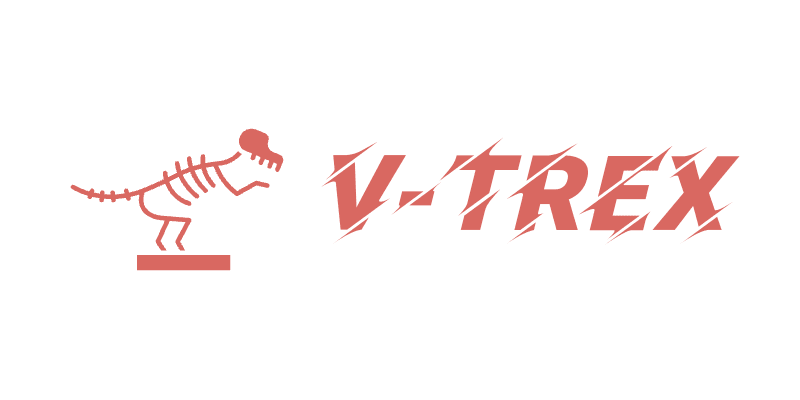
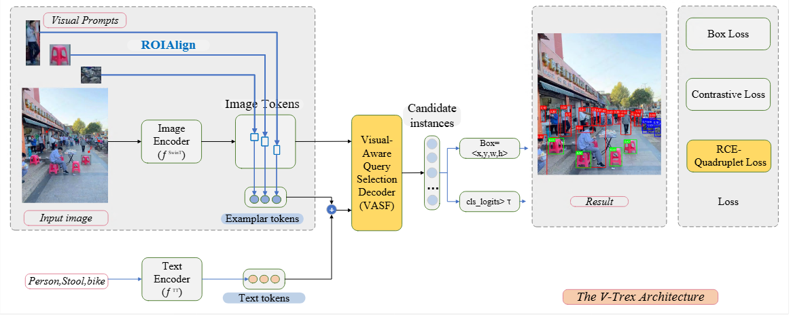
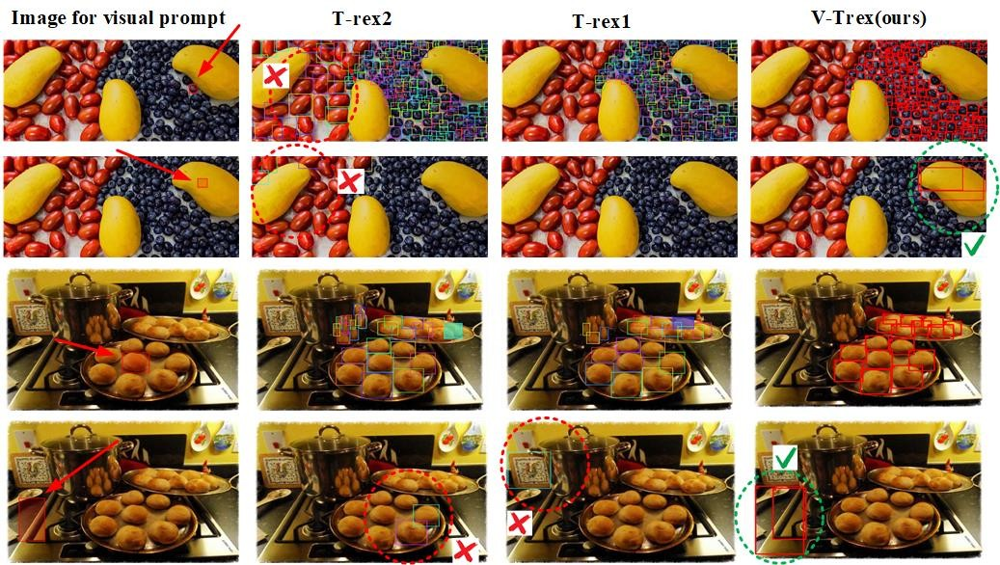

  

# Contents 
- [Contents 📜](#contents-)
- [1. Introduction 📚](#1-introduction-)
  - [What Can V-TRex Do 📝](#what-can-V-Trex-do-)
- [2. COCO-BED dataset 🎮](#2-try-demo-)

# 1. Introduction 
Object detection is a crucial component of computer vision, enabling the localization and identification of objects within images. It plays a vital role in a wide range of applications, from autonomous driving to content moderation. A significant limitation of traditional object detection models is their closed-set nature. These models are trained on a predefined set of categories and are thus restricted to recognizing only those specific categories. The training process itself is highly complex, requiring expert knowledge, extensive datasets, and meticulous model tuning to achieve the desired accuracy. Moreover, the introduction of a new object category exacerbates these challenges, necessitating the repetition of the entire training process.
V-Trex addresses these limitations by integrating both text and visual prompts into a single model, thereby leveraging the strengths of both modalities. The synergy between text and visual prompts endows V-Trex with robust zero-shot capabilities, making it a versatile tool in the dynamic landscape of object detection.th text and visual prompts in one model, thereby harnessing the strengths of both modalities. The synergy of text and visual prompts equips V-Trex with robust zero-shot capabilities, making it a versatile tool in the ever-changing landscape of object detection.

## What Can V-TRex Do
V-Trex is highly adaptable to a wide range of real-world applications, including but not limited to power utilities, steel manufacturing, agriculture, industry, livestock and wildlife monitoring, biology, medicine, Optical Character Recognition (OCR), retail, electronics, transportation, logistics, and more. V-Trex primarily supports three key workflows: interactive visual prompt workflow, general visual prompt workflow, and text prompt workflow. These workflows are designed to cover the majority of scenarios that require object detection.

## V-Trex framwork

<!-- insert image in the middle -->

  

## COCO-BED Dataset
We have open-sourced the dataset generation script and the dataset itself. The script is available at:
`./dataset_and_code/generate_coco_bed_v1.2.py`

The dataset can be found at:
`./dataset_and_code/coco_bed/instances_val2017_bed.json`

This dataset includes 20 randomly visualized images for reference.

## Result 

<!-- insert image in the middle -->

  

# 2. Related Works
:fire: We express our gratitude to the outstanding algorithms such as T-rex and T-rex2, Dino-X, Yoloworld, and others.

# 3. LICENSE
We use [AilabDeepX License 1.0](LICENSE)

